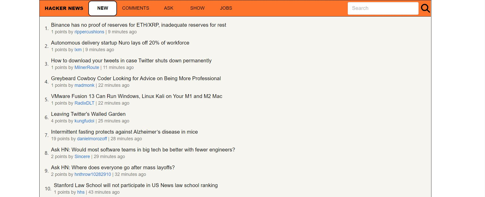

# Hacker News Clone

## Description
### Build a Hacker News Clone with features:-
- Data is coming from the Hacker News API
- Processing the Data and convert it into JSON Format
- Show the data in the list
- Filtering data on basis of New, comments, ask, show, etc.
- Search bar which helps us to find a particular news
- Search results can be filter on basis of popularity, date, stories, comments, etc.

## See Live Demo

### visit --> https://newshacker12.netlify.app/

## Screenshots

### Home Page

### Search Page

## Technologies Stack:

- React
- Javascript
- CSS
- MUI

### How to install
- Clone the project onto your local machine.
- npm start
- That's it now project is ready for use.